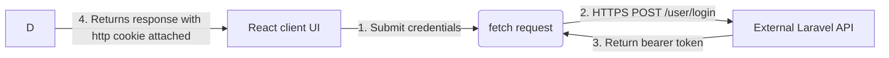
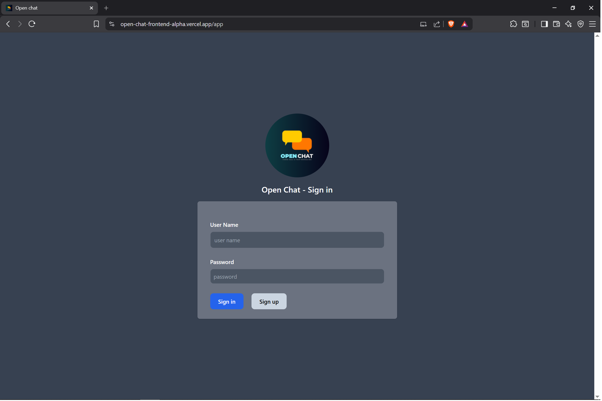

# Open chat (Frontend - React)

## Overview
Open chat frontend is an app for instant messaging and video calling.

---

## Features
 - User login and authentication UI
 - Real-time chat interface
 - Video calling using WebRTC
 - Incoming call popup UI
 - Reponsive design

---

## Tech stack

- React v19
- WebRTC
- Context API
- Pusher client

---

## Client side window architecture

### 1. User authentication window
<details>
<summary><b>View architecture: session lifecycle</b></summary>


#### Visual proof
<p align="center">
    
</p>
</details>

---

## Installation

1. Clone the repository
```git clone https://github.com/progssp/open_chat_frontend.git
cd open_chat_frontend```
   
2. Install dependencies
```npm install
npm run start```

3. browse the app via http://localhost:3000