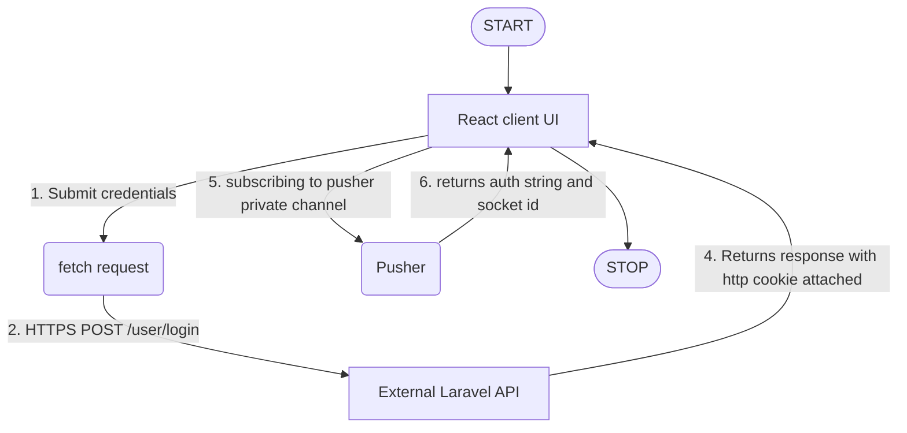
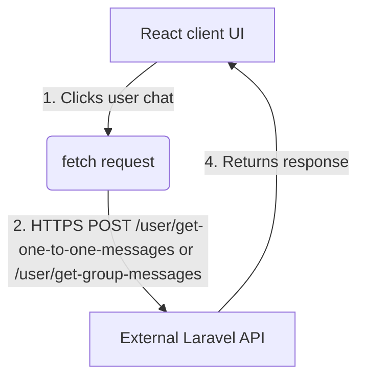
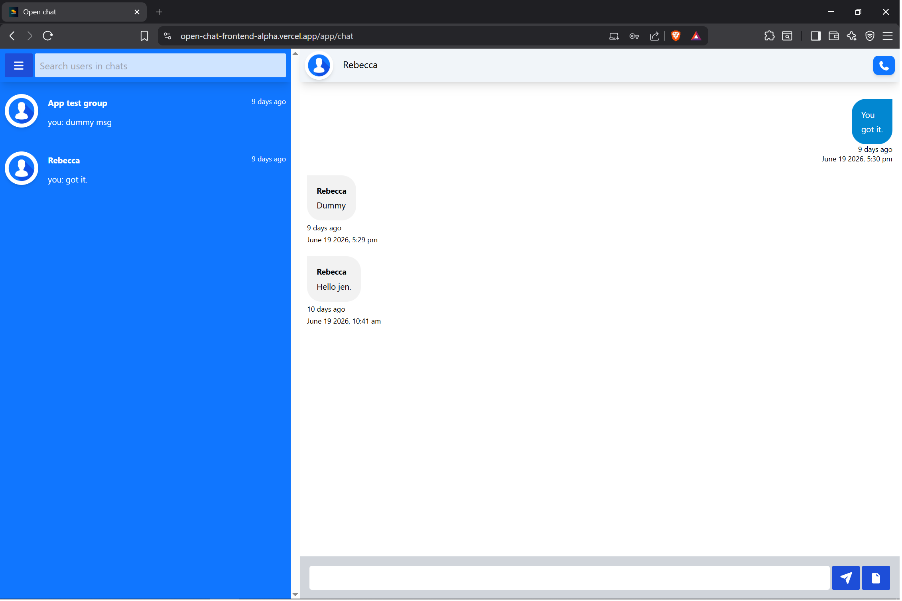
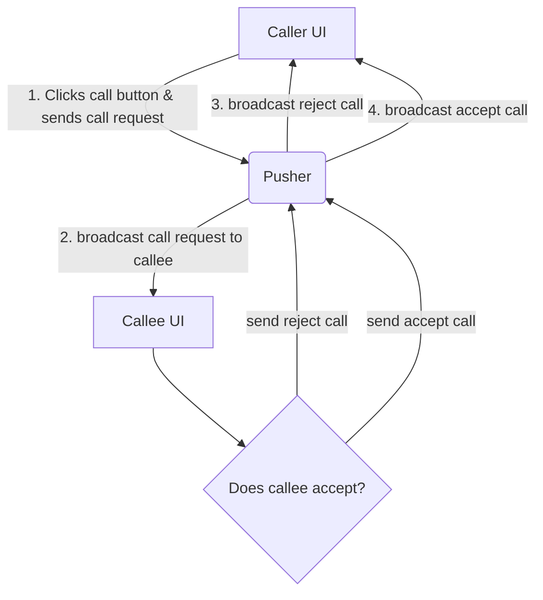
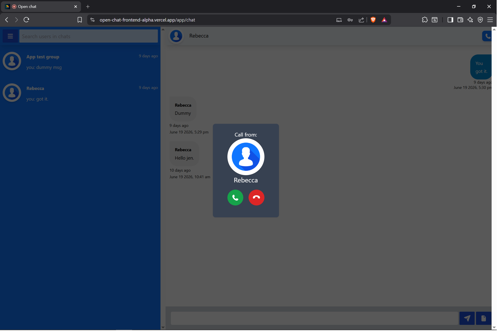
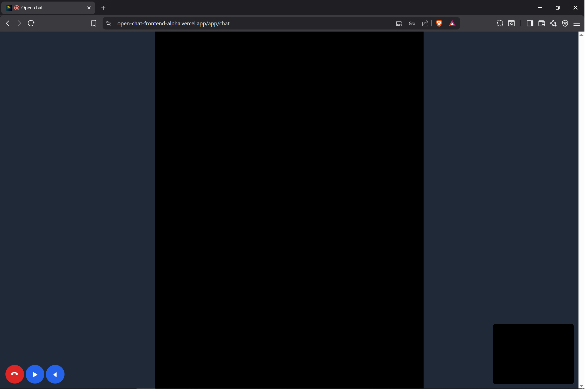
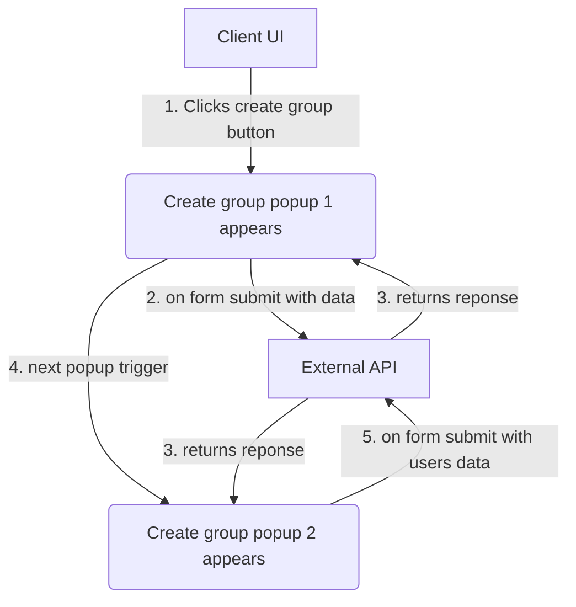
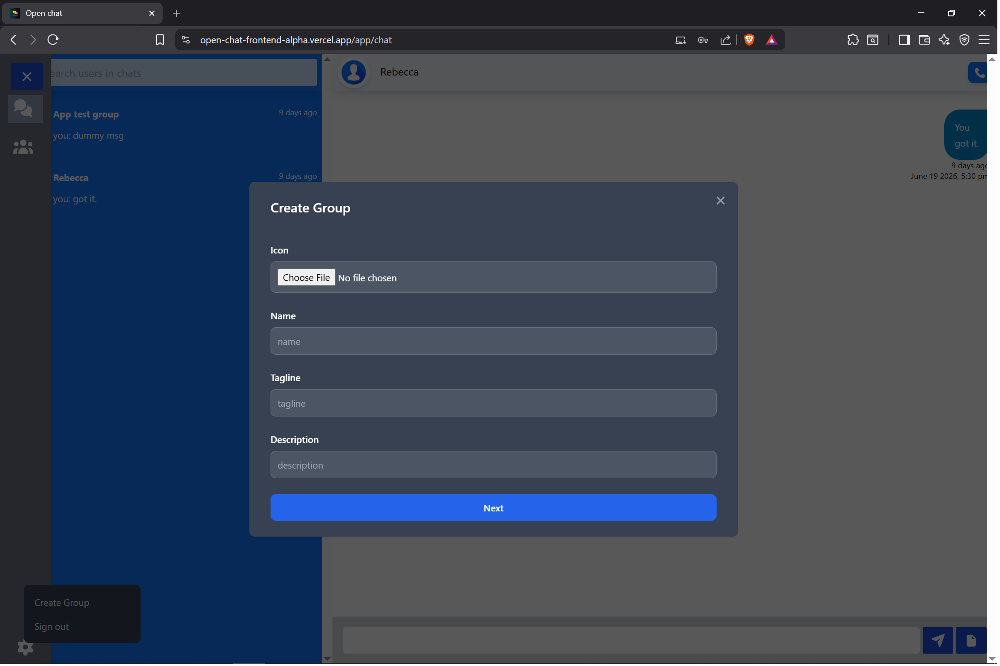
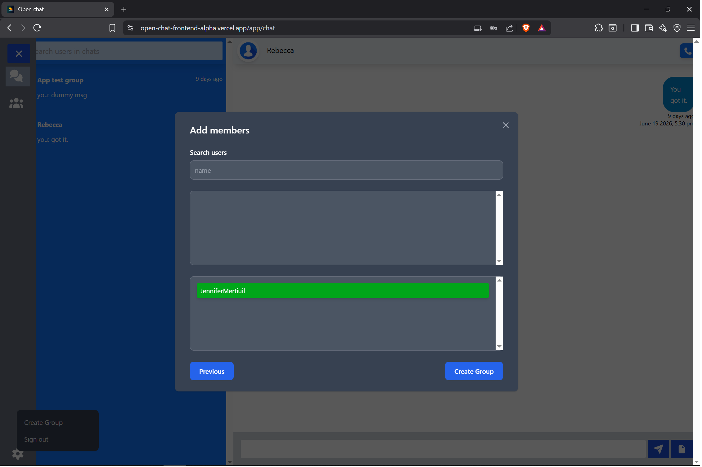
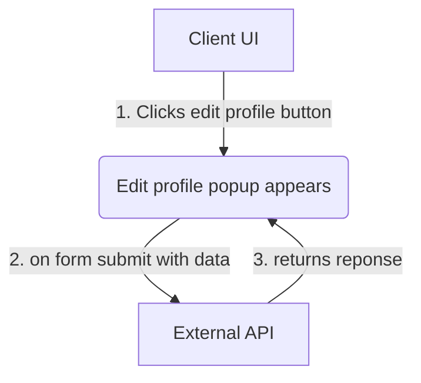

# Open chat (Frontend - React)

## Demo link
[](https://open-chat-frontend-alpha.vercel.app/app)

---

## Back end repo link
[](https://open-chat-frontend-alpha.vercel.app/app)

---

## Overview
Open chat frontend is an app for instant messaging and video calling.

---

## Features
 - User login and authentication UI
 - Real-time chat interface
 - Video calling using WebRTC
 - Incoming call popup UI
 - Reponsive design

---

## Tech stack

- React v19
- WebRTC
- Context API
- Pusher client

---

## Client side window architecture

### 1. User authentication window
<details>
<summary><b>View architecture: session lifecycle</b></summary>


#### Visual proof
<p align="center">
    
</p>
</details>

---

### 2. User chat window
<details>
<summary><b>View architecture: chat loading lifecycle</b></summary>


#### Visual proof
<p align="center">
    
</p>
</details>

---

### 3. User call window
<details>
<summary><b>View architecture: video/audio call lifecycle</b></summary>


#### Visual proof
<p align="center">
    
    
</p>
</details>

---

### 4. User create group window
<details>
<summary><b>View architecture: create group lifecycle</b></summary>


#### Visual proof
<p align="center">
    
    
</p>
</details>

---

### 5. User edit profile window
<details>
<summary><b>View architecture: edit profile lifecycle</b></summary>



</details>

---

## Installation

 -- Clone the repository by typing command ```git clone https://github.com/progssp/open_chat_frontend.git```

 -- ```cd open_chat_frontend```
   
 -- Install dependencies by using command ```npm install && npm run start```

 -- browse the app via http://localhost:3000